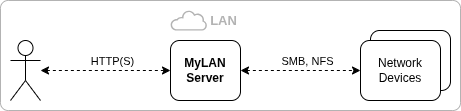

# MyLAN - LAN Media Share and Streaming Project

**MyLAN** provides access to shared resources within the heterogenous LAN through web interface. Once resource is shared by owner it became available for browsing (folders), download and streaming from any device within entire LAN.

The project is a [Netty](https://netty.io) based networking sanndbox. No artifact planned to be published. The project expected to be built and run locally in a home LAN. 

Project utilizes author's experience (as a software developer) into something useful and can be used as a reference for some approaches and solutions java developers do. Some may find it useful.

### Roadmap and development progress

... still in progress

- [x] [User Management](docs/user-mgmt.md)
- [x] LAN Device discovery
- [x] SMB Client (partially)
- [ ] NFS Client
- [x] Device Account Management
- [ ] Browsing remote device -- in progress
- [ ] Shares and bookmarks
- [ ] Download
- [ ] Stream media from remote device

### Source code mirrors

* [Github](https://github.com/roolic-gh/mylan)
* [Codeberg](https://codeberg.org/roolic/mylan)

### More to read

* [Documentation](docs/index.md)
* [References](docs/refs.md)

